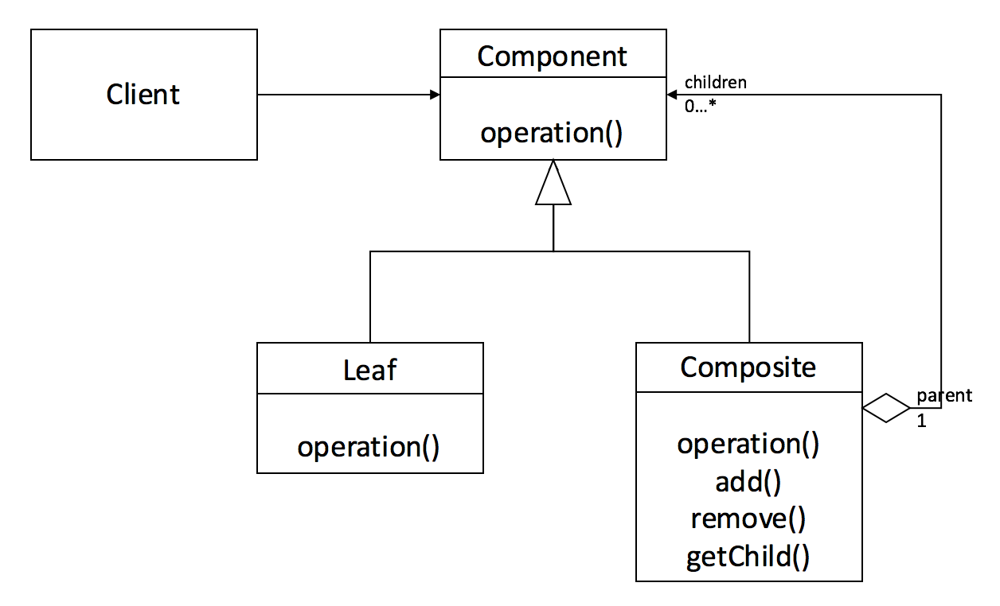
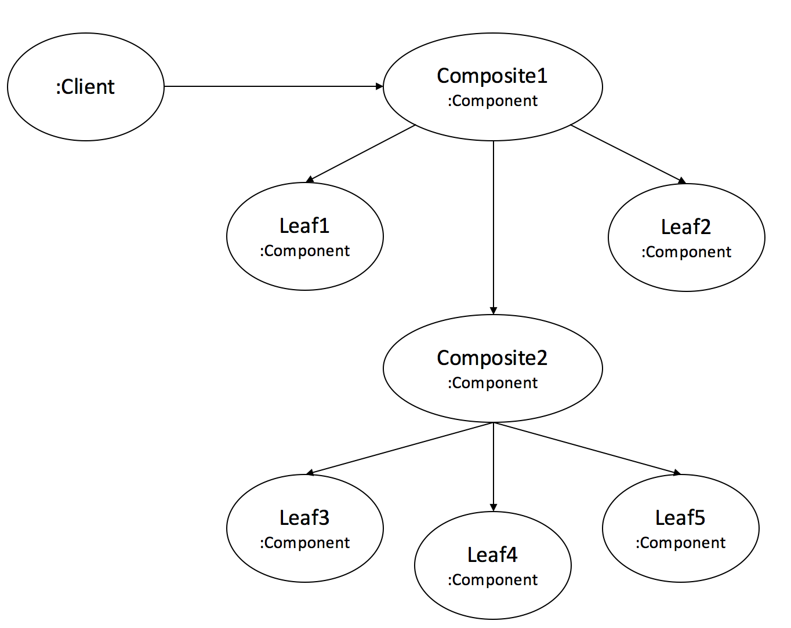

[DesignPattern](../DesignPattern.md)

> [!quote]-
> https://mygumi.tistory.com/343

컴포지트 패턴(Composite Pattern)은 객체들을 트리 구조로 구성하여 부분-전체 계층을 나타내는 패턴입니다.
이 패턴을 사용하면 개별 객체와 복합 객체를 동일한 방식으로 처리할 수 있습니다.

`Client` 클래스는 `Leaf` 와 `Composite` 클래스를 직접 참조하지 않고, 공통 인터페이스 `Component` 를 참조한다.
`Leaf` 클래스는 `Component` 인터페이스를 구현한다.
`Composite` 클래스는 `Component` 객체 자식들을 유지하고, operation() 과 같은 요청을 통해 자식들에게 전달한다.

- Component : 모든 component 들을 위한 추상화된 개념으로써, `Leaf` 와 `Composite` 클래스의 인터페이스이다.
- Leaf : `Component` 인터페이스를 구현하고, 구체 클래스를 나타낸다.
- Composite : `Component`  인터페이스를 구현하고, 구현되는 자식(Leaf or Composite) 들을 가지고, 이러한 자식들을 관리하기 위한 메소드(addChild, removeChild...)를 구현한다.
또한, 일반적으로 인터페이스에 작성된 메소드는 자식에게 위임하는 처리를 한다.

`Client` 에서 트리 구조에서의 top-level 에 존재하는 `Composite1` 에 요청을 보낸다.그러면 `Component` 인터페이스를 구현한 객체들은 트리 구조를 토대로 위에서 아래 방향으로 모든 자식 요소에게 전달하게 된다.
