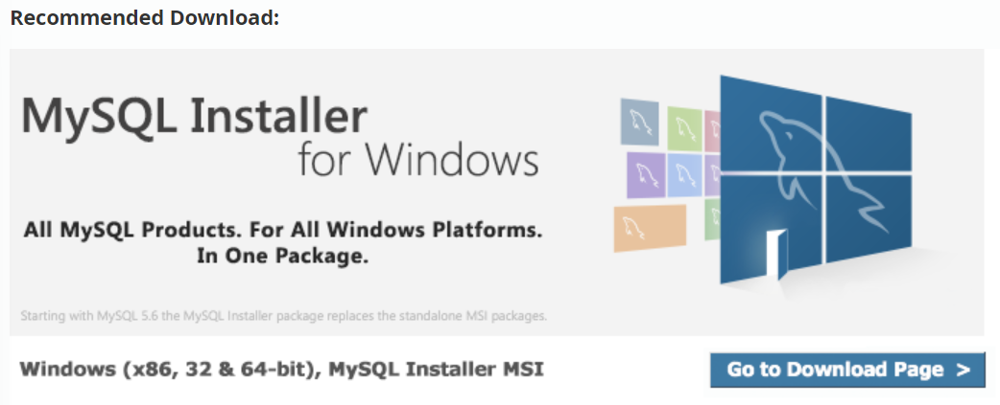

[..](../MySql.md)

- Index
    
    01. Install
    
    01) MySQL Community Server
    
    (01) Downlaod
    
    (02) Install
    
    (03) Verification
    
    02. MySQL Workbench 사용법
    

---

# 01. Install

> [!info] MySQL :: MySQL Community Downloads  
>  
> [https://dev.mysql.com/downloads/](https://dev.mysql.com/downloads/)  

## 01) MySQL Community Server

### (01) Downlaod

> [!info]  
>  
> [https://dev.mysql.com/downloads/mysql/](https://dev.mysql.com/downloads/mysql/)  

- Step 01. Download Spec
    - Select Version : 8.0.35
    - Select Operating System : Windows
- Step 02. Go to Download Page 이동
    
    
    
- Step 03. Version & System 확인 후 MSI Installer Download
    
    - 자연스럽게 mysql-installer-community-8.0.35.0.msi download
        
        (위에 항목은 On-line Installer 같다…)
        
    
    
    
    - ==Download 클릭 시 로그인 필요 화면이 뜨지만 아래 텍스트 버튼으로 PASS!==
        
        
        

### (02) Install

- Install Img
    
    
    
    
    
    
    
    
    
    
    
    
    
    
    
    
    
    
    
    
    
    
    
    
    
    
    
    
    
    
    
    
    
    
    
    
    
    
    
    
    
    
    
    
    
    
    

### (03) Verification


---

# 02. MySQL Workbench 사용법

- Execution Button
    
    
    
    전체 실행 or 블록 처리된 라인 실행
    
    
    
    현재 커서 라인 실행
    
    ```SQL
    -- 주석 1 : 해당 라인 주석
    
    # 주석 1 : 해당 키워드 이후 주석
    
    /*
    주석 3 : 다중 라인 주석
    */
    ```
    
- 모든 데이터베이스 목록 보기
    
    ```SQL
    -- 모든 데이터베이스 목록 보기
    show databases;
    ```
    
    
    
- 데이터베이스 생성 및 확인
    
    ```SQL
    -- 데이터베이스 생성 및 지정
    create database NBE_DB; #생성
    show databases;
    # 삭제 drop database NBE_DB;
    ```
    
    
    
- 데이터베이스 지정 및 테이블 생성 & 데이터 삽입
    
    ```SQL
    -- 데이터 베이스 지정 및 테이블 생성 및 데이터 삽입
    #지정
    use NBE_DB;
    # 테이블 생성
    create table NBE_Table (
    			col1 INT,
    			col2 CHAR(2)
    );
    # 데이터 삽입
    insert into NBE_Table (col1, col2)
    value (1, 'a'), (2, 'b'), (3, 'c'), (4, 'd'), (5, 'e');
    # 확인
    select * from NBE_Table;
    ```
    
    